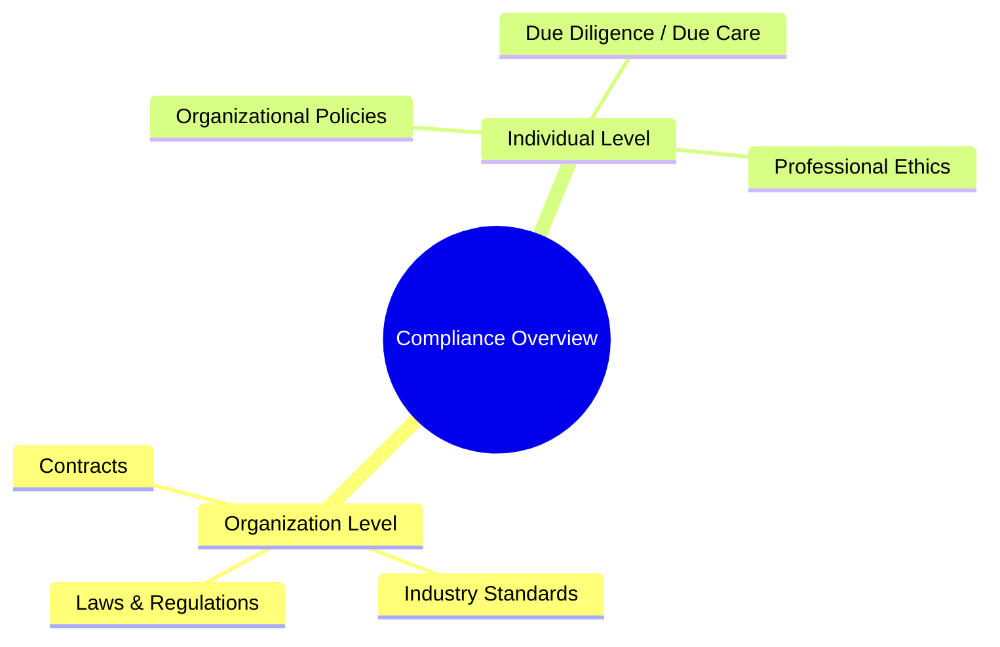

# Compliance
Fulfilment of specified requirements

## What is Compliance?
用以評估是否達到相關的==要求==事項的指標

符合性(compliance)
用以評估是否達到相關的==要求==事項的指標

有效性(effectiveness)
用以評估是否達成==目標==且可量化效益的的指標

Laws 的本質，就是 Rules 

---
## Laws & regulations

法律和法規的相似之處在於兩者都是強制性要求。但是，它們在分權或政府結構方面存在一些細微差別。一般來說，法律是指立法部門製定和通過的規則，而法規是行政部門製定的規則
Laws (立法機關制定) and Regulations (行政機關制定) and Common Laws (司法判例)

---

Organization Level
- Laws & Regulations
- Industry Standards
- Contracts

Individual Level 
- Organizational Policies
- Due Diligence /Due Care
- Professional Ethics

