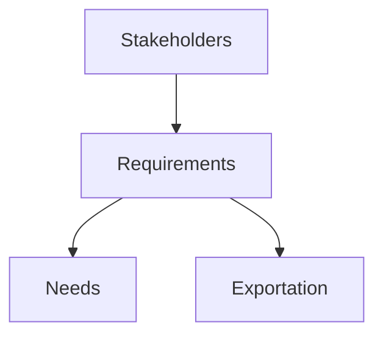

# Introduction to Engineering
Information Systems Security Engineering, *page.369*

工程的本質：做東西
工程的目標：做出有品質的好東西

---
## How to read Engineering?

Introduction
	Approches
	Security Models
	Cryptology
Specific Topic
	Data Center
	Network
	Software

---

Stakeholders --> Requirements --> Needs, Exportation

Requirements
	Opportunities
	Threats
	Problems

1. Solutions
	==Design== 設計： 先有書面
2. 探討系統元素及其關係 --> Architecture

做好一個工程的能力需求： standard by ==ISO 15288==
	1. 本職學能硬功夫
	2. 專案管理軟實力

---

## Engineering Approaches
*page.372*
[![[Introduction to Engineering-image-20250720.jpeg]]](https://i1.wp.com/wentzwu.com/wp-content/uploads/2020/07/NIST-SP-800-160-V1-and-ISO-15288.jpg?ssl=1)

Main standard
- ISO 15288
- NIST SP 800-160 V1

![[Introduction to Engineering-image-20250720 2.png]]
==V&V== Key-point: Verification 內驗證, Validation 外確認
- Verification -->驗證正確性
- Validation --> 確認有效性

品質管理
- Quality Assurance, Q.A --> 保過程
- Quality Control, Q.C --> 保產品

---
## Certification and Accreditation

C & A: 評鑑系統的安全控制與授權系統可以上線的流程
- 驗證(Certification):由獨立第三方確認某一項產品、過程或服務，能否符合規定要求達到一定標準。(安全評鑑)
- 認證(Accreditation):指主管機關對某實驗室或驗證機構給予正式認可，證明其有能力執行某特定工作ex: SGS的食品服務部是經過衛生福利部TFDA認證。

---
![[Introduction to Engineering-image-20250720.png]]