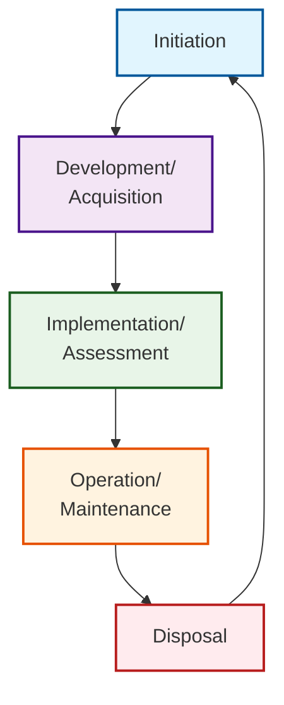

# Software Engineering
*page.378*

## Quality Software
![[Software Engineering-image-20250720.jpeg]]

Software
	Functionality
	Quality
Quality: U PASS ME!
	Usability
	Performance
	Availability
	Scalability
	==Security==
	Maintenance
	Extensibility
	

服務可用性，like 99.999%，是來量化可用性的一個指標
uptime --> 可用度
downtime -->

---
## SDLC: Software or System

### Software Development Life Cycle
![[Software Engineering-image-20250720 1.png]]

課程中軟體開發
- 談交付不談部署
- 談維護不談營運


### System Development Life Cycle

- Initiation
- Development/ Acquisition
- Implementation/ Assessment
- Operation/ Maintenance
- Disposal


---
## Software Overview

Software Environment
- Development Environment 開發環境
- Testing environment 測試環境
- Staging environment 過度環境
- Production environment 正式環境
- run-time environment --> 技術角度

Software Development Tools
- version control system: like "Git"

TIPS: 
時時都安全、處處都安全

---
## Software Runtime Environment

Hypervisor 是 VM 管家 by NIST
Mobile code 是 NIST強調的風險重點

## ==Code Repository and IDE==
*page.434*
Distributed
- ==Git==
- Mercurial
Client/ Server
- CVS
- SVN
Proprietary
- Microsoft TFS
- Bitbucket

## Object-Oriented Programming
*page.437*

Class & Object
- Attributes --> Properties 屬性
- Operations --> Methods 方法

```Example:
class Car:
    def __init__(self, color, brand):
        self.color = color      # 屬性
        self.brand = brand      # 屬性

    def drive(self):            # 方法
        print(f"{self.brand} 正在行駛")
```

OOP Features
- 封裝(Encapsulation):
	- 為了避免外部隨意存取Class中的Properties & Methods而實施存取限制的動作
- 繼承(Inheritance):
	- 子類別可繼承父類別的屬性和方法
- 多型(Polymorphism):
	- 不同類別的物件可以通過相同的接口進行操作，而表現出不同的行為(即方法的具體實現)。兩種做法:Overload & Override

Principles:
- 高聚合(High cohesion):
	- 盡量是相關的Properties & Methods才放到同一個Class中
- 低耦合(Low coupling):：
	- 盡量不要用別人的程式，即便使用也要避免將程式模組互相綁得太緊，當某個模組因某些原因不可用而需要更換時，可以降低更換模組的影響

---
## Testing Phase

Code Module <-- pair with --> Unit Test
```Example
# production Code Module
def add(a, b):
    return a + b

# 對應的 Unit Test
def test_add():
    result = add(2, 3)
    assert result == 5
```

### Software Testing Techniques
*page.442*

- Unit Testing
- Code Review
	- Pair Programming
	- Code Scanners
	- Fagan Inspection
- Integration Testing
	- Regression Testing
	- Interface testing (API & UI) --> 供 Module 之間互動
	- Fuzz Testing
- System Testing
	- Stress Testing
	- Security Testing
- Misure Case Testing
- User Acceptance Testing (UAT)
- Installation Testing
- Synthetic Transactions
