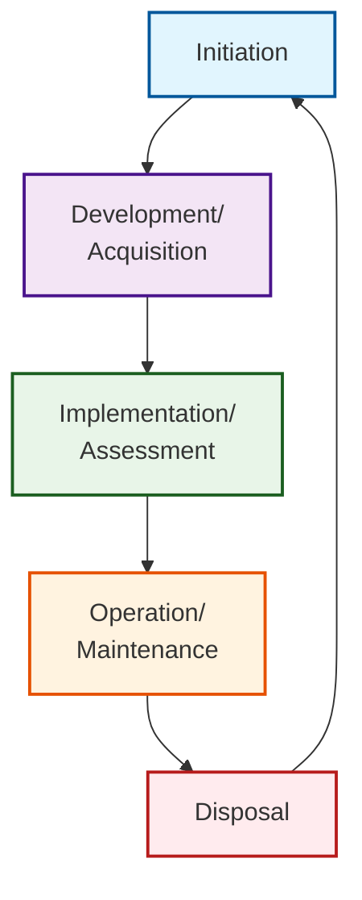

# Software Engineering
*page.378*

## Quality Software
![[Software Engineering-image-20250720.jpeg]]

Software
	Functionality
	Quality
Quality: U PASS ME!
	Usability
	Performance
	Availability
	Scalability
	==Security==
	Maintenance
	Extensibility
	

服務可用性，like 99.999%，是來量化可用性的一個指標
uptime --> 可用度
downtime -->

---
## SDLC: Software or System

### Software Development Life Cycle
![[Software Engineering-image-20250720 1.png]]

課程中軟體開發
- 談交付不談部署
- 談維護不談營運

### System Development Life Cycle

- Initiation
- Development/ Acquisition
- Implementation/ Assessment
- Operation/ Maintenance
- Disposal

---
## Software Overview

Software Environment
- Development Environment 開發環境
- Testing environment 測試環境
- Staging environment 過度環境
- Production environment 正式環境
- run-time environment --> 技術角度

Software Development Tools
- version control system: like "Git"

TIPS: 
時時都安全、處處都安全

---
## Software Runtime Environment

Hypervisor 是 VM 管家 by NIST
Mobile code 是 NIST強調的風險重點

## ==Code Repository and IDE==

Distributed
- ==Git==
- Mercurial
Client/ Server
- CVS
- SVN
Proprietary
- Microsoft TFS
- Bitbucket

